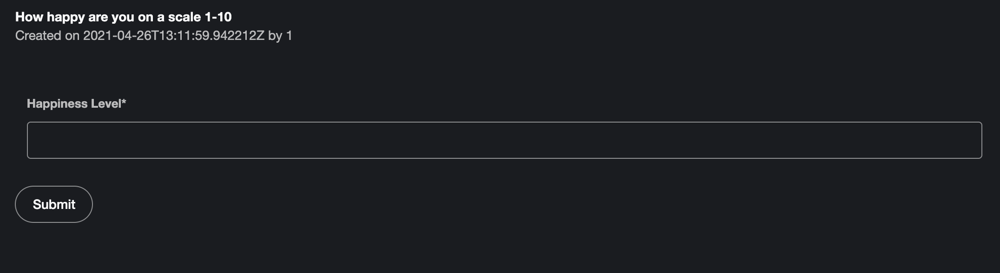
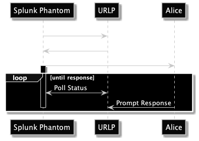

# urlprompt

> Custom URL prompts for Splunk Phantom

[](https://github.com/splunk/urlprompt/actions/workflows/main_ci.yml)

Documentation available at https://splunk.github.io/urlprompt/



## Overview



## Repository Structure

    .
    ├── api                     # DRF-based REST API
    ├── docs                    # Documentation files for Mkdocs
    ├── core                    # Core Django models and shared entities
    ├── phurlprompt             # Phantom App directory
    ├── web                     # React-based web frontend
    ├── proxy                   # Nginx configuration for docker-compose
    └── README.md

## Development
This section gives you a brief overview on how to set up a development environment

### Server

Create a new virtual environment and activate it
```
poetry shell
```

Install dependencies
```
poetry install
```

Bootstrap configuration based on .env.example. Adjust as necessary.
```
cp .env.example .env
```

Run database migrations
```
python manage.py migrate
```

Create admin user for Django Admin
```
python manage.py createsuperuser
```

Get API token. This will create a new user within Django and a Token to authenticate.
```
python manage.py createapitoken <username>
```

Run the Django development server
```
python manage.py runserver
```

### Web

Change to `web` application directory
```
cd web
```

Install dependencies
```
yarn install
```

Run development server
```
yarn dev
```

### Docs

Run local Mkdocs server
```
mkdocs serve
```